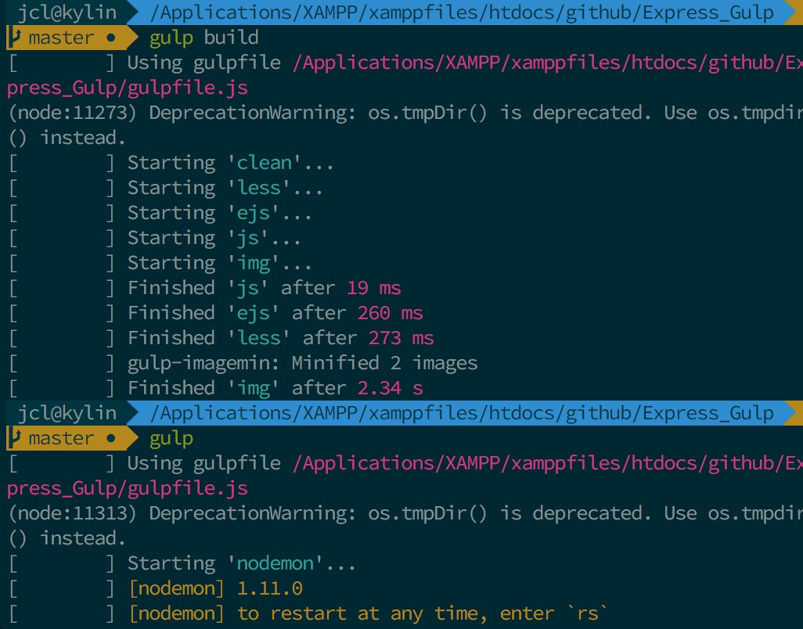

 > 原来用的`React`+`Webpack`时，体验到那种同步压缩修改的快感。这次使用`Express`时，也想达到那种效果，一番折腾后，于是有了下图，项目地址：[https://github.com/ycjcl868/Express_Gulp](https://github.com/ycjcl868/Express_Gulp)


### 目的
我使用`Express`+`Ejs`+`Less`开发，想开发时对所有资源进行`压缩`并`同步`到浏览器端，Google搜索一遍，都不是太符合我的项目要求。于是看着`Gulp文档`结合`npmjs.com`终于折腾完毕。


### Quickstart

#### 安装

clone项目
```bash
$ git clone https://github.com/ycjcl868/Express_Gulp.git
```

切换目录，安装依赖
```bash
$ cd Express_Gulp && npm install
```

#### 使用
开发模式，具备热更新，边修改浏览器边刷新，`dev` 端口 `7000`，配置项端口为 `3001`
```bash
$ npm run dev
```

构建项目，将文件压缩、打包、编译，输出 `dist` 目录
```bash
$ npm run build
```

生产模式，不具备热更新，运行在 `3000` 端口
```bash
$ npm run start
````

### 配置
下面说下我的配置方法：

#### 我的目录结构：

```
├── app.js   # Express Server
├── bin
│   └── www  # 启动Server
├── dist     # 编译压缩目录(部署目录)
│   ├── css
│   ├── img
│   ├── js
│   ├── views
│   └── lib  # 第三方库目录(bower安装)
├── .bowerrc # bower前端安装库
├── gulpfile.js  # Gulp配置文件
├── package.json
├── public       # 开发目录
│   ├── img
│   ├── js
│   └── less
├── routes
│   ├── index.js
│   └── users.js
└── views      # html
    ├── error.ejs
    └── index.ejs
```


